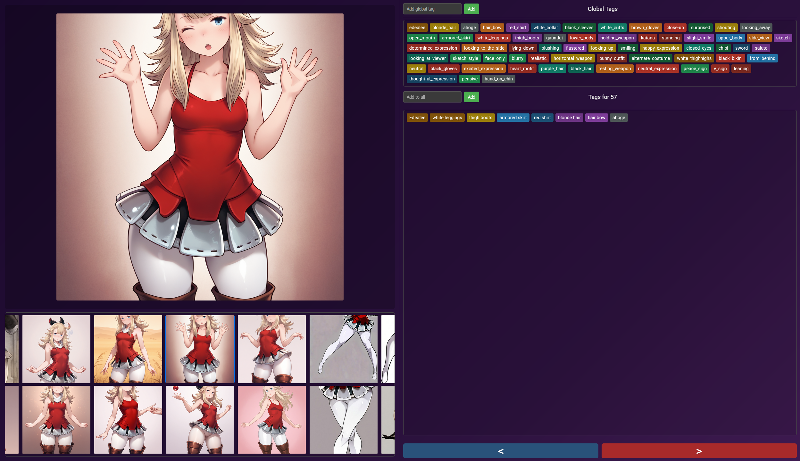

# Lora Image Tagger (lora-tagger-single-folder)

## Description

The Lora Image Tagger is a web-based application designed to streamline the process of preparing image datasets for Lora (Low-Rank Adaptation) model training. It allows users to load a local folder of images, navigate through them efficiently, and assign descriptive tags. These tags are saved in individual `.txt` files that correspond to each image file, a common format for AI training datasets.

The application features a Node.js/Express backend to serve the user interface and manage file system operations like reading images and saving tag files. The frontend provides a user-friendly interface for tagging and navigation.

## Features

*   **Load Local Image Folder**: Users can specify a full path to a local directory containing their images. The application will then load and display these images.
*   **Gallery View**: A scrollable thumbnail gallery allows for quick visual scanning and selection of images.
*   **Main Image Display**: A larger area displays the currently selected image.
*   **Global Tag Management**:
    *   Add new tags to a persistent global list.
    *   Global tags are stored in the browser's localStorage, so they are remembered across sessions.
    *   Clicking a tag in the global list adds it to the currently selected image.
*   **Current Image Tag Management**:
    *   View and edit tags applied specifically to the currently selected image.
    *   Remove tags from an image by clicking on the tag in the "current image tags" area.
    *   Tags can also be removed by dragging them out of the "current image tags" area.
    *   Tags for each image are saved as a comma-separated list in a `.txt` file with the same name as the image (e.g., `my_image.png` will have its tags saved in `my_image.txt`).
*   **"Add to All" Functionality**: Quickly add a specific tag to every image currently loaded from the project folder.
*   **Keyboard Navigation**:
    *   Use the Left Arrow key or 'A' key to navigate to the previous image.
    *   Use the Right Arrow key or 'D' key to navigate to the next image.
*   **State Persistence**:
    *   The application remembers the last successfully loaded project folder path (via localStorage).
    *   The list of global tags is also persisted in localStorage.
*   **Backend Support**: A simple Node.js and Express backend serves the static frontend files and handles API requests for file listing, image serving, and tag saving.

## How to Run

### Prerequisites

*   Node.js (which includes npm) must be installed on your system.

### Setup and Launch

1.  **Clone the Repository** (if you have it as a Git repository):
    ```bash
    git clone <repository-url>
    cd lora-tagger-single-folder
    ```
    If you only have the files, navigate to the project directory in your terminal.

2.  **Install Dependencies**:
    Open a terminal in the project's root directory and run:
    ```bash
    npm install
    ```
    This will install Express, CORS, and Nodemon (for development).

3.  **Start the Server**:
    *   For production/standard mode:
        ```bash
        npm start
        ```
    *   For development mode (with automatic server restart on file changes using Nodemon):
        ```bash
        npm run dev
        ```

4.  **Access the Application**:
    Open your web browser and go to:
    ```
    http://localhost:3000
    ```
    (Or the port specified in `server.js` if you changed it).

5.  **Load Images**:
    In the application UI, you will be prompted to enter the **full absolute path** to your image project folder. For example:
    *   Windows: `C:\Users\YourName\MyLoraProject\images`
    *   macOS/Linux: `/home/yourname/my_lora_project/images`

    Click the "Load" button to load the images from the specified directory.

## API Endpoints

The backend provides the following API endpoints:

*   **`POST /api/list-folder`**
    *   **Description**: Lists image files and reads the content of corresponding `.txt` tag files from a specified folder.
    *   **Request Body**: `{ "folderPath": "path/to/your/image_folder" }`
    *   **Response**: JSON object containing `imageFiles` (an array of image filenames), `textFileContents` (an object mapping `.txt` filenames to their content), and `resolvedFolderPath` (the absolute path to the folder on the server).

*   **`GET /api/image`**
    *   **Description**: Serves a specific image file.
    *   **Query Parameters**:
        *   `folderPath`: The absolute path to the folder containing the image.
        *   `imageName`: The filename of the image.
    *   **Response**: The image file.

*   **`POST /api/save-tags`**
    *   **Description**: Saves a list of tags to a `.txt` file for a specific image. The `.txt` file will have the same base name as the image.
    *   **Request Body**: `{ "folderPath": "path/to/folder", "imageName": "image.jpg", "tags": ["tag1", "tag2", "tag3"] }`
    *   **Response**: JSON object confirming success or failure.

This README should provide a good overview of the project.
```
