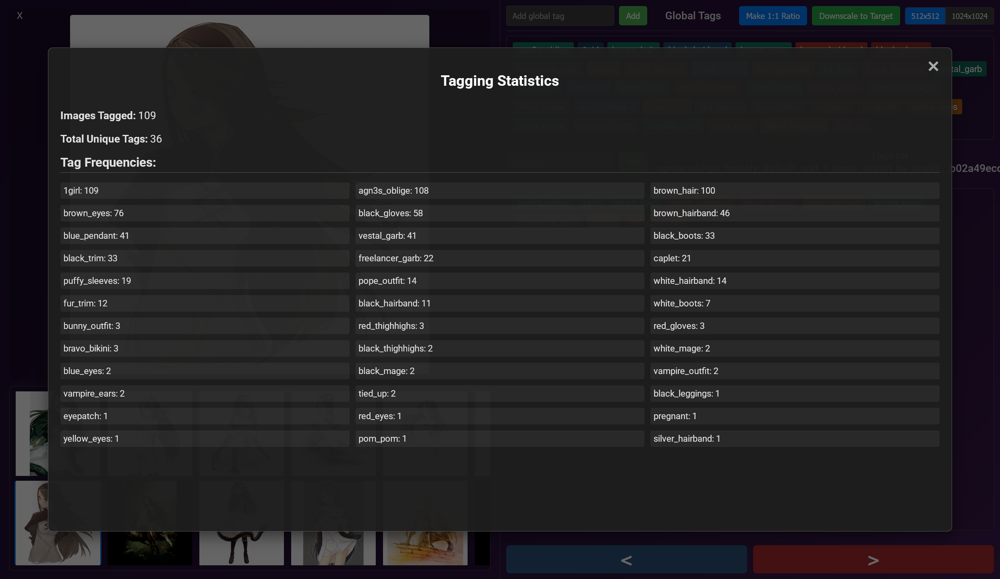
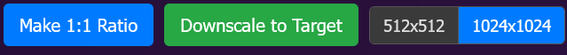

## 1.2 Added Stats page to better copy paste tags



## 1.1 Added button to fill out images of not 1:1 ratio and downscale higher than 512x512 or 1024x1024 resolution



## 1.0 UI (bit outdated)
 


# Lora Image Tagger

## Description

The Lora Image Tagger is a web-based application designed to streamline the process of preparing image datasets for training Loras. It allows users to load a local folder of images, navigate through them efficiently, and assign descriptive tags. These tags are saved in individual `.txt` files that correspond to each image file, a common format for AI training datasets.

The application features a Node.js/Express backend to serve the user interface and manage file system operations like reading images and saving tag files. The frontend provides a user-friendly interface for tagging and navigation.

## Features

*   **Load Local Image Folder**: Users can specify a full path to a local directory containing their images. The application will then load and display these images.
*   **Gallery View**: A scrollable thumbnail gallery allows for quick visual scanning and selection of images.
*   **Main Image Display**: A larger area displays the currently selected image.
*   **Global Tag Management**:
    *   Add new tags to a persistent global list.
    *   Global tags are stored in the browser's localStorage, so they are remembered across sessions.
    *   Clicking a tag in the global list adds it to the currently selected image.
*   **Current Image Tag Management**:
    *   View and edit tags applied specifically to the currently selected image.
    *   Remove tags from an image by clicking on the tag in the "current image tags" area.
    *   Tags can also be removed by dragging them out of the "current image tags" area.
    *   Tags for each image are saved as a comma-separated list in a `.txt` file with the same name as the image (e.g., `my_image.png` will have its tags saved in `my_image.txt`).
*   **"Add to All" Functionality**: Quickly add a specific tag to every image currently loaded from the project folder.
*   **Keyboard Navigation**:
    *   Use the Left Arrow key or 'A' key to navigate to the previous image.
    *   Use the Right Arrow key or 'D' key to navigate to the next image.
*   **State Persistence**:
    *   The application remembers the last successfully loaded project folder path (via localStorage).
    *   The list of global tags is also persisted in localStorage.
*   **Image Processing**:
    *   **Make 1:1 Ratio Button**:
        *   Converts the currently selected image to a 1:1 aspect ratio by padding it.
        *   The padding color is automatically determined based on the average color of the image's existing border pixels (resulting in black or white).
        *   Any transparent areas within the original image content are also filled with this determined color.
        *   The image is expanded to the larger of its original dimensions (e.g., a 800x600 image becomes 800x800).
    *   **Downscale to Target Button**:
        *   Downscales the currently selected image to the target size chosen by the 512x512 / 1024x1024 switch.
        *   **Important Preconditions**:
            1.  The image *must* already have a 1:1 aspect ratio (use "Make 1:1 Ratio" first if needed).
            2.  The image's current width (and height, since it's 1:1) *must* be larger than the selected target size.
        *   The application will show an error if these preconditions are not met.
    *   **Recommended Image Processing Workflow**:
        1.  Select an image.
        2.  Click "Make 1:1 Ratio" to make the image square and fill transparencies. The image will be saved immediately.
        3.  (Optional) At this stage, you might use an external tool to upscale the 1:1 image if its resolution is smaller than your desired final target (e.g., if you have a 800x800 image but want a 1024x1024 final output, you might upscale it to 1024x1024 or larger externally).
        4.  If the (now 1:1) image is larger than your desired final training resolution (e.g., you have a 1500x1500 image but want 1024x1024), select the desired target size (512 or 1024) using the switch, and then click "Downscale to Target". The image will be resized and saved.
*   **Backend Support**: A simple Node.js and Express backend serves the static frontend files and handles API requests for file listing, image serving, tag saving, and image processing.

## How to Run

### Prerequisites

*   Node.js (which includes npm) must be installed on your system.

### Setup and Launch

1.  **Clone the Repository**
    ```bash
    git clone https://github.com/Vibecoder9000/SmoothTagger
    cd SmoothTagger
    ```
	
2.  **Install Dependencies**:
    Open a terminal in the project's root directory and run:
    ```bash
    npm install
    ```
	
3.  **Start the Server**:
	```bash
	npm start
	```

4.  **Access the Application**:
    Open your web browser and go to:
    ```
    http://localhost:3000
    ```

5.  **Load Images**:
    Enter the **full absolute path** to your image project folder. For example:
    *   Windows: `C:\Users\YourName\MyLoraProject\images`
    *   macOS/Linux: `/home/yourname/my_lora_project/images`

## API Endpoints

The backend provides the following API endpoints:

*   **`POST /api/list-folder`**
    *   **Description**: Lists image files and reads the content of corresponding `.txt` tag files from a specified folder.
    *   **Request Body**: `{ "folderPath": "path/to/your/image_folder" }`
    *   **Response**: JSON object containing `imageFiles` (an array of image filenames), `textFileContents` (an object mapping `.txt` filenames to their content), and `resolvedFolderPath` (the absolute path to the folder on the server).

*   **`GET /api/image`**
    *   **Description**: Serves a specific image file.
    *   **Query Parameters**:
        *   `folderPath`: The absolute path to the folder containing the image.
        *   `imageName`: The filename of the image.
    *   **Response**: The image file.

*   **`POST /api/save-tags`**
    *   **Description**: Saves a list of tags to a `.txt` file for a specific image. The `.txt` file will have the same base name as the image.
    *   **Request Body**: `{ "folderPath": "path/to/folder", "imageName": "image.jpg", "tags": ["tag1", "tag2", "tag3"] }`
    *   **Response**: JSON object confirming success or failure.

*   **`POST /api/make-one-to-one`**
    *   **Description**: Processes an image to make its aspect ratio 1:1 by padding it. The padding color is determined from border pixels. Fills internal transparency.
    *   **Request Body**: `{ "folderPath": "path/to/folder", "imageName": "image.jpg" }`
    *   **Response**: JSON object confirming success (including new dimensions, fill color used) or failure.

*   **`POST /api/downscale-to-target`**
    *   **Description**: Downscales an image to a specified target size (e.g., 512x512 or 1024x1024).
    *   **Preconditions**: Image must already be 1:1 aspect ratio and larger than the target size.
    *   **Request Body**: `{ "folderPath": "path/to/folder", "imageName": "image.jpg", "targetSize": 512 }`
    *   **Response**: JSON object confirming success (including new dimensions) or failure (including precondition violations).
